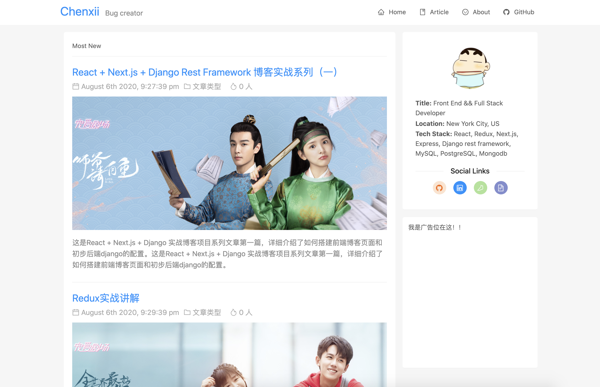
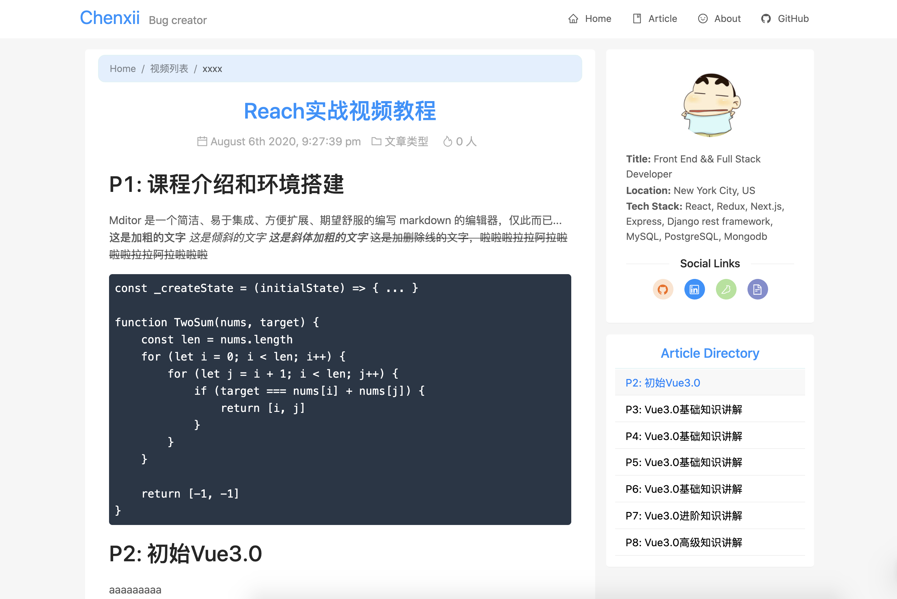
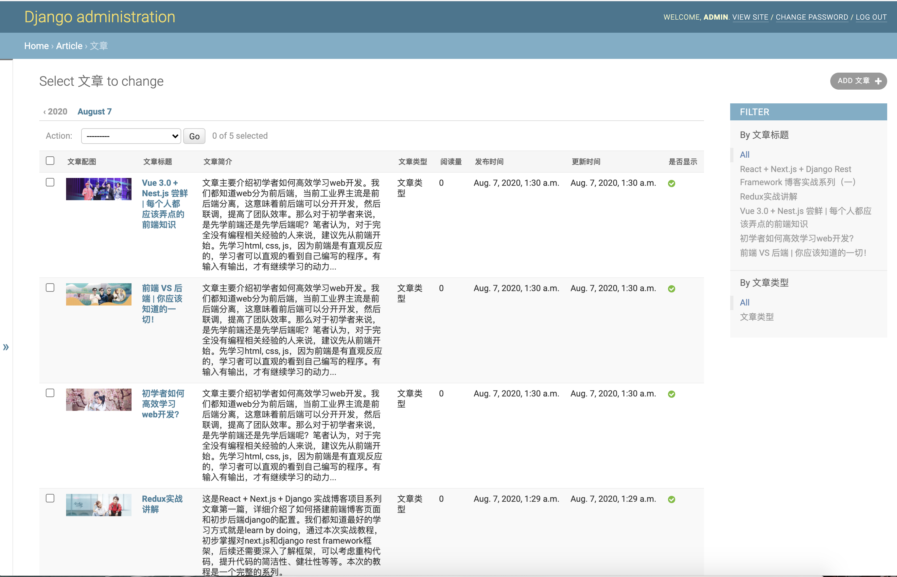
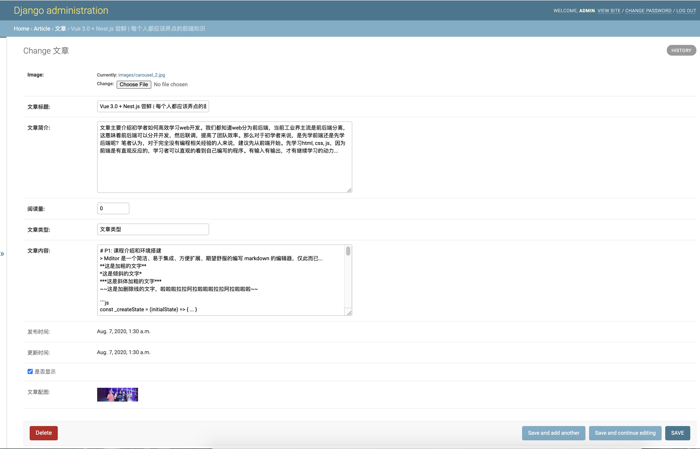

# Next + Redux + Django REST Framework Blog Project

> This is a blog full stack project based on Nextjs, Redux, and Django REST Framework.
> If you like this project, please do not forget to give a star!

### TODO:

- advertising module

## Preview

### Front End

**Home Page**


**Article Page**


### Admin





## Run in local

1. git clone project

```
git clone https://github.com/ChenxiiCheng/NextJS-DjangoREST-Blog.git
cd NextJS-DjangoREST-Blog
```

2. server side

```
cd server
python3 -m venv env                 // create env environment
source ./venv/bin/activate          // linux or mac
pip install django djangorestframework pillow  // install dependencies
python3 manage.py makemigrations    // Migrate database
python3 manage.py migrate
python3 manage.py createsuperuser   // Create admin superuser
python3 manage.py runserver         // Run django development server
```

3. front end side

```
cd front end
yarn add  or  npm install           // install dependencies
yarn dev  or npm run dev            // run project
```

## Tech Stack

- Next.js
- Ant Design UI
- Redux
- Redux Devtools Extension
- React Redux
- Django REST Framework
- React Markdown
- Markdown Navbar
- Moment
